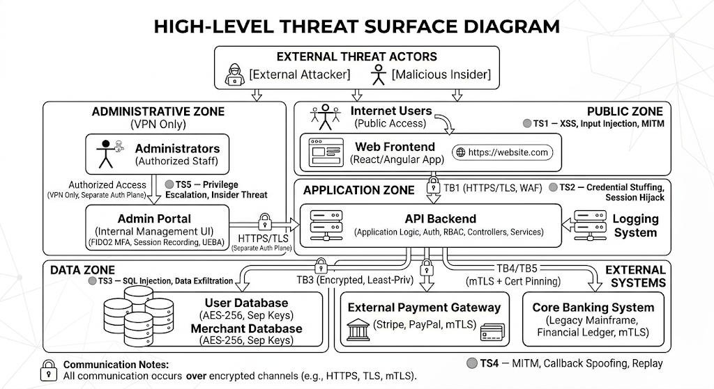
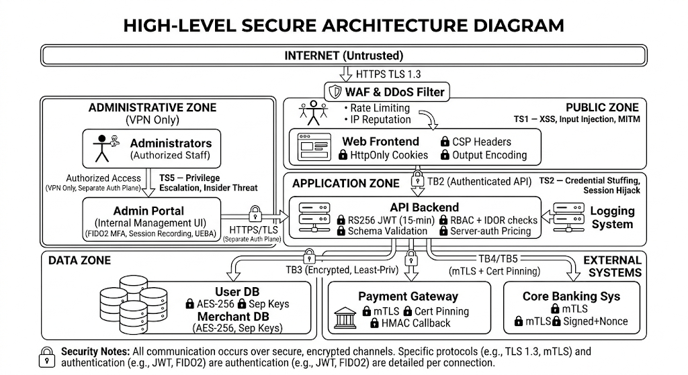

# CS382 – Secure Architecture & Threat Modeling
**Habib University | Semester 8 | Cybersecurity: Theory, Tools, and Practices (CS382)**

| | |
|---|---|
| **Scenario** | Option A – Online Payment Processing Application |
| **Assignment** | Assignment 1 – Secure Architecture & Threat Modeling |
| **Submitted** | February 2026 |

---

# Task 1 – System Definition & Architecture

## 1.1 System Overview

This system is a web-based online payment processing platform that enables customers to securely pay merchants through card-based and digital transactions. The platform integrates with external banking infrastructure to authorize and settle payments. It exposes a public-facing web interface for customers, a separate portal for merchants, and a restricted administrative interface for internal staff. All components are designed under a cloud-agnostic architecture with no dependency on vendor-specific services, making the system portable and infrastructure-independent.

The application is internet-facing, assumed to be accessible at scale, and is designed to uphold high availability and strong security guarantees across all layers.

---

## 1.2 Application Components

| Component | Description |
|---|---|
| **Web Frontend** | The customer-facing browser interface through which users register, log in, initiate payments, and view transaction history. Communicates with the Backend API over HTTPS. |
| **API Backend** | The central application server that processes all business logic, routes requests, validates inputs, and orchestrates communication between all internal and external components. |
| **Admin Portal** | A restricted interface for system administrators to monitor transactions, manage users, investigate suspicious activity, and view audit logs. Accessible only from the Administrative Zone. |
| **User Database** | Stores customer account information, hashed credentials, session metadata, and transaction history. |
| **Merchant Database** | Stores merchant account details, settlement configuration, and merchant transaction records. |
| **Payment Gateway** | An external third-party service that processes card payments, handles credit/debit card authorization, and returns transaction status to the Backend API. |
| **Core Banking System** | An external banking system responsible for fund settlement and transfer between financial accounts. Accessed over a secure API channel. |
| **Logging & Monitoring System** | A centralized system collecting application logs, security event logs, and admin activity records. Used for auditing, anomaly detection, and forensic analysis. |

---

## 1.3 Users and Roles

| Role | Type | Description |
|---|---|---|
| Customer | Human User | Registers, logs in, and initiates payment transactions through the Web Frontend. |
| Merchant | Human User | Receives payments, views settlement reports, and manages their merchant profile. |
| System Administrator | Human User | Monitors transactions, manages user accounts, resolves disputes, and accesses audit logs. |
| Payment Gateway | External System | Receives payment requests from the Backend API; returns authorization results. |
| Core Banking System | External System | Receives settlement instructions from the Backend API; processes final fund transfers. |
| External Attacker | Threat Actor | An unauthorized party attempting to exploit internet-facing components. |
| Malicious Insider | Threat Actor | An internal user or administrator attempting to abuse authorized access for unauthorized purposes. |

---

## 1.4 Data Types Handled

| Data Type | Sensitivity | Description |
|---|---|---|
| Personal Data | High | Full name, email address, phone number, home address of customers and merchants. |
| Authentication Data | High | Usernames, hashed passwords (salted), session tokens, MFA codes. |
| Financial Transaction Data | Critical | Transaction IDs, payment amounts, timestamps, settlement records, bank references. Raw card data is never permanently stored. |
| Merchant Settlement Records | High | Records of payments owed and transferred to merchants; commercially sensitive. |
| Administrative Data | High | Audit logs, system configuration data, admin action history. |
| Integration Credentials | Critical | API keys, service authentication tokens, database credentials used for internal and external communication. |

---

## 1.5 External Dependencies

| Dependency | Role |
|---|---|
| Payment Gateway Provider | Processes card payments and returns authorization status. |
| Core Banking System | Performs final settlement and fund transfer between accounts. |
| Email / SMS Service Provider | Delivers transaction confirmations, fraud alerts, and authentication codes to users. |

Each of these external integrations introduces an additional trust boundary and associated security risks including availability dependency, supply chain risk, and the inability to audit external party controls directly.

---

## 1.6 Trust Boundaries

Trust boundaries define points where data crosses between security zones, requiring validation, authentication, or encryption before transit is permitted.

| Boundary | From | To | Controls Required |
|---|---|---|---|
| TB1 | Internet (Public Zone) | Web Frontend | HTTPS/TLS, WAF, input validation |
| TB2 | Web Frontend | API Backend | Authenticated API calls, server-side validation, rate limiting |
| TB3 | API Backend | Databases | Authenticated DB connections, least-privilege credentials, encrypted at rest |
| TB4 | API Backend | Payment Gateway | Mutual TLS, API key authentication, HMAC callback verification |
| TB5 | API Backend | Core Banking System | Mutual TLS, signed requests with timestamps |
| TB6 | Admin Portal | API Backend | MFA-enforced, role-based access, separate authentication plane |

**Security Zones:**

- **Public Zone** — Untrusted internet-facing users (customers, merchants)
- **Application Zone** — Web Frontend, Backend API, Logging & Monitoring System
- **Data Zone** — User DB, Merchant DB
- **External Systems Zone** — Payment Gateway, Core Banking System
- **Administrative Zone** — Admin Portal (restricted network access only)

---

## 1.7 Architecture Diagram

The diagram illustrates all system components, security zones, and encrypted data flows between the Public Zone, Application Zone, Data Zone, Admin Zone, and External Systems Zone. All communication is over HTTPS/TLS or Mutual TLS.

---

## 1.8 Data Storage Approach

| Data Category | Storage Method |
|---|---|
| User & Merchant Records | Relational database (PostgreSQL/MySQL), encrypted at rest, backend-only access |
| Transaction Data | Relational database, append-only design, integrity-protected |
| Passwords | Salted cryptographic hash (Argon2id); never stored in plaintext |
| Audit Logs | Centralized log store, write-only for applications, read-only for administrators |
| Secrets & Credentials | Dedicated secrets management system; never hardcoded; least-privilege access |

---

# Task 2 – Asset Identification & Security Objectives

## 2.1 Critical Asset Inventory

Assets are resources with value to the organization that require protection — including data, credentials, business logic, financial records, and system components.

| Asset | Type | CIA Priority | Rationale |
|---|---|---|---|
| User Credentials | Sensitive | C, I | Must be kept confidential to prevent account takeover. Integrity ensures credentials are not silently altered. |
| Administrator Credentials | Critical | C, I | Compromise grants full system control over all users, configurations, and financial operations. |
| Personal Identifiable Information (PII) | Personal | C, I | Sensitive personal data subject to GDPR. Unauthorized disclosure constitutes a reportable breach. |
| Financial Transaction Data | Financial | I, A | Must be tamper-proof for legal compliance and dispute resolution. Must remain available for auditing and reporting. |
| Merchant Settlement Records | Financial | C, I | Errors or tampering cause financial loss and merchant disputes. Commercially sensitive. |
| Business Logic | Intellectual Property | I | If tampered with, attackers could manipulate transaction processing or bypass fraud detection. |
| API Keys & Integration Secrets | Credential | C, I | Compromise allows attackers to impersonate the system to external providers, enabling fraudulent transactions. |
| Database Systems | Infrastructure | C, I, A | Stores all sensitive data. Breach exposes entire system dataset; unavailability halts all operations. |
| Audit Logs | Operational | I, A | Must remain unmodified to ensure accountability. Required for incident response and forensic investigation. |
| System Availability | Operational | A | Payment systems must operate continuously. Downtime causes direct financial loss and reputational damage. |

---

## 2.2 Security Objectives

The following four security objectives apply across all assets. Each asset is mapped to the objectives it prioritises.

**Confidentiality** — Sensitive data must only be accessible to authorized parties. Applies to user credentials, PII, administrator credentials, financial data, and API keys. Unauthorized disclosure could result in fraud, identity theft, and regulatory penalties.

**Integrity** — Data must remain accurate and unmodified throughout its lifecycle. Most critical for financial transaction records, merchant settlement records, business logic, and audit logs — where tampering has direct financial or legal consequences.

**Availability** — Critical systems and data must remain accessible when needed. Payment transaction processing and settlement services require high uptime. Downtime prevents transactions and causes financial loss.

**Accountability** — All transactions and administrative actions must be traceable. Audit logs must remain tamper-resistant and comprehensive enough to support fraud investigations and satisfy regulatory requirements.

---

## 2.3 Critical Asset Prioritization

Based on impact analysis, the assets requiring the strongest protection mechanisms (addressed in Task 4) are:

1. **Administrator Credentials** — Compromise grants full platform control
2. **Financial Transaction Data** — Direct financial integrity and audit compliance
3. **API Keys and Integration Secrets** — External impersonation risk
4. **Audit Logs** — Underpin all accountability and forensic investigation
5. **Database Systems** — Contain all other sensitive assets

---

# Task 3 – Threat Modeling (STRIDE)

## 3.1 Methodology

Threat modeling was conducted using the STRIDE framework, covering all six required threat areas: authentication, authorization, data storage, API communication, logging and monitoring, and administrative access. For each identified threat, a risk level (Low, Medium, or High) was assigned by evaluating impact severity against the realistic likelihood that a motivated attacker could execute the attack, given the system's internet-facing deployment and handling of financial data.

---

## 3.2 Threat Surface Diagram

The diagram annotates the base architecture with five threat surfaces (TS1–TS5), indicating the components targeted by each threat category.

| Threat Surface | Label | Targets |
|---|---|---|
| TS1 | XSS, Input Injection, MITM | Web Frontend |
| TS2 | Credential Stuffing, Session Hijack | API Backend, Authentication |
| TS3 | SQL Injection, Data Exfiltration | User DB, Merchant DB |
| TS4 | MITM, Callback Spoofing, Replay | Payment Gateway, Core Banking System |
| TS5 | Privilege Escalation, Insider Threat | Admin Portal |

---

## 3.3 STRIDE Threat Model Table

| # | Threat | STRIDE Category | Affected Component | Impact | Likelihood | Risk Level |
|---|---|---|---|---|---|---|
| T1 | Credential stuffing — automated login attempts with leaked password lists | Spoofing | Web Frontend, API Backend (TB1, TB2) | High — unauthorized account access | High (automated tooling widely available) | **High** |
| T2 | Session token hijacking via XSS — injected script reads session cookie | Tampering / Information Disclosure | Web Frontend (TS1) | High — full account impersonation | High (XSS is a very common web vector) | **High** |
| T3 | Merchant API key exposure via source code or logs | Spoofing | API Backend, Payment Gateway (TB4) | High — fraudulent transactions billed to merchant | Medium (requires access to code or log files) | **High** |
| T4 | JWT algorithm confusion attack (RS256 → HS256 or alg:none) | Spoofing | API Backend | Critical — any identity can be forged | Medium (requires knowledge of JWT library behaviour) | **High** |
| T5 | Payment amount tampering — attacker modifies amount in API request using Burp Suite | Tampering | API Backend (TB2) | Critical — pay any amount attacker chooses | Medium (trivial with a proxy tool) | **High** |
| T6 | SQL injection via unsanitized API parameter — attacker dumps database | Information Disclosure | API Backend, User DB (TS3) | Critical — full customer and transaction data exfiltration | Medium (requires identifying unsanitized input) | **High** |
| T7 | Payment Gateway callback spoofing — forged webhook marks unpaid transaction as paid | Spoofing | API Backend, Payment Gateway (TB4) | Critical — goods obtained without payment | Medium (requires discovering callback URL) | **High** |
| T8 | Man-in-the-middle on internal API to Payment Gateway — traffic intercepted | Information Disclosure | Payment Gateway integration (TB4, TS4) | Critical — live payment data in transit | Low (requires network-level position on backend path) | **Medium** |
| T9 | Replay attack on Core Banking System — captured signed request resubmitted | Spoofing | Core Banking System (TB5, TS4) | High — unauthorized fund transfer | Low (requires prior capture of a signed request) | **Medium** |
| T10 | IDOR / broken object level authorization — user accesses another user's transaction | Elevation of Privilege | API Backend | High — cross-user data breach | High (very common API vulnerability) | **High** |
| T11 | Vertical privilege escalation — customer-level user reaches admin functions | Elevation of Privilege | API Backend, Admin Portal (TS5) | Critical — full system control | Medium (requires bypassing RBAC enforcement) | **High** |
| T12 | Malicious insider with admin access exfiltrates bulk customer data | Elevation of Privilege / Info Disclosure | Admin Portal (TS5) | Critical — full data access without triggering alerts | Medium (insider access is authorized at the network layer) | **High** |
| T13 | Admin portal credential compromise via phishing or password spray | Spoofing | Admin Portal (TB6, TS5) | Critical — full system administrative control | Medium (phishing is common; admins are high-value targets) | **High** |
| T14 | Audit log tampering — attacker deletes log entries to erase breach evidence | Tampering | Logging & Monitoring System | High — forensic investigation undermined | Medium (requires write access to log storage) | **High** |
| T15 | Insufficient security event logging — attacks proceed undetected | Repudiation | Logging & Monitoring System | High — extended attacker dwell time | Medium (easy to miss without explicit audit rules) | **Medium** |
| T16 | DDoS attack floods Backend API, disrupting payment processing | Denial of Service | API Backend | High — payment processing fully unavailable | High (DDoS is low-cost to execute) | **High** |
| T17 | Encryption at rest with keys stored alongside data — data exposed despite encryption | Information Disclosure | User DB, Merchant DB (TS3) | Critical — encryption rendered useless | Low (requires key infrastructure access) | **Medium** |
| T18 | Secrets and credentials written to application logs | Information Disclosure | Logging System, All Services | High — credentials exposed to log readers | Medium (common developer mistake) | **High** |

---

## 3.4 Risk Reasoning

Risk levels were derived by applying the formula: **Risk = Impact × Likelihood**, mapped to a qualitative scale (Low / Medium / High).

**High-risk threats (T1–T7, T10–T14, T16, T18)**

These threats are rated High because they combine a High or Critical impact with a Medium or High likelihood. Credential stuffing (T1), XSS (T2), SQL injection (T6), and DDoS (T16) are extremely common in web-facing payment systems and require minimal attacker sophistication. Payment amount tampering (T5) and callback spoofing (T7) are particularly severe because they result in direct financial fraud with no technical barrier beyond a proxy tool and the callback URL. Admin portal compromise (T13) and malicious insider abuse (T12) carry Critical impact because admin access grants control over the entire system. Log tampering (T14) is rated High because it undermines every other control — an attacker who can erase audit trails can operate undetected indefinitely.

**Medium-risk threats (T8, T9, T15, T17)**

These threats are rated Medium because their likelihood is constrained by technical prerequisites. MITM attacks on TLS connections (T8) and replay attacks (T9) require network-level positioning and capture of signed requests — both significantly harder when mTLS is in place. Logging misconfiguration (T15) and key mismanagement (T17) are operationally plausible but require specific deployment failures to be exploitable. These threats are not dismissed — they represent residual risks that controls in Task 4 specifically address.

---

# Task 4 – Secure Architecture Design

The security controls in this section are designed at the architectural level — structural decisions that are built into how the system is organized, not patches applied after the fact. Every control is traceable back to a specific threat from the STRIDE analysis in Task 3, and each addresses one or more of the CIA+A security objectives identified in Task 2.

---

## 4.1 Identity and Access Management (IAM)

### Multi-Factor Authentication (MFA)
All user login flows — customer, merchant, and administrator — must require a second authentication factor beyond a password. For administrators, hardware-based FIDO2 keys (phishing-resistant) are required. Customers use TOTP-based MFA.

**Justification:** Directly mitigates T1 (credential stuffing) and T13 (admin phishing). Even when credentials are leaked or guessed, MFA prevents an attacker from completing authentication. FIDO2 keys specifically defeat real-time phishing proxy tools that capture TOTP codes, eliminating the primary credential-based admin compromise vector.

### Role-Based Access Control (RBAC) with Least Privilege
Every component enforces access based on role. Customers access only their own transactions. Merchants access only their own accounts. Administrators have scoped access to configuration — not raw database access. Each internal service uses a dedicated credential that grants only its specific required permissions.

**Justification:** Directly mitigates T10 (IDOR), T11 (privilege escalation), and T12 (insider abuse). Server-side ownership validation on every object access eliminates IDOR. Least-privilege service accounts limit the blast radius if any service is compromised.

### Separate Administrative Authentication Plane
The Admin Portal uses a completely separate authentication mechanism from the customer and merchant flows — different login endpoint, different session store, different credential management, accessible only from restricted internal networks (TB6).

**Justification:** Mitigates T11 and T13. A compromise of the customer-facing authentication system cannot grant admin access. Admin sessions cannot be hijacked via XSS attacks on the public frontend.

### Short-Lived JWT Tokens with Asymmetric Signing
API authentication uses OAuth 2.0 with JWTs signed using RS256 (RSA asymmetric). Access tokens expire after 15 minutes. The `alg:none` JWT value is explicitly rejected at the API Backend.

**Justification:** Directly mitigates T2 (session hijacking — short lifespan limits stolen token window) and T4 (JWT algorithm confusion — asymmetric signing with explicit algorithm rejection eliminates the RS256→HS256 attack).

---

## 4.2 Network Segmentation

The architecture enforces five security zones with strict inter-zone communication rules:

| Zone | Contents | Communication Rules |
|---|---|---|
| Public Zone | Internet-facing users (customers, merchants) | May only reach Application Zone via TB1 over HTTPS/TLS |
| Application Zone | Web Frontend, Backend API, Logging & Monitoring | Internal components communicate over authenticated encrypted channels; Frontend has no direct Data Zone access |
| Data Zone | User DB, Merchant DB | Accessible only from Backend API over authenticated, encrypted connections (TB3) |
| External Systems Zone | Payment Gateway, Core Banking System | Accessible only from Backend API over Mutual TLS (TB4, TB5) |
| Administrative Zone | Admin Portal | Accessible only via VPN or internal restricted network; separate auth plane (TB6) |

**Justification:** Network segmentation enforces containment boundaries. A successful attack on the Web Frontend gives an attacker nothing beyond that component — reaching the databases or admin systems requires additionally defeating API authentication, RBAC enforcement, and inter-zone firewall rules independently. This defense-in-depth approach directly limits the impact of T11, T12, and T13, and reduces the blast radius of every other identified threat.

---

## 4.3 Data Protection

### TLS for All Communications
All in-transit communication uses TLS 1.3 (minimum TLS 1.2). Mutual TLS (mTLS) is enforced for Backend API → Payment Gateway (TB4) and Backend API → Core Banking System (TB5), with certificate pinning for these critical financial integrations.

**Justification:** Mitigates T8 (MITM on payment channel) and T9 (replay attacks on CBS). mTLS specifically prevents impersonation of the Payment Gateway, and certificate pinning ensures no rogue CA certificate enables a MitM even if a CA is compromised.

### Encryption at Rest
All databases use AES-256 encryption at rest. Encryption keys are stored in a dedicated Secrets Manager — never alongside the database files. Field-level encryption is applied to especially sensitive columns.

**Justification:** Mitigates T17. Encryption at rest ensures raw database files cannot be read without decryption keys, even if physical storage is compromised. Separate key storage means the encrypted data and the key are never in the same place.

### Payment Card Data Tokenization
Card data is captured by the Payment Gateway directly — raw card numbers (PAN) never reach internal servers. Only a non-reversible token is stored and referenced for future transactions.

**Justification:** Directly addresses PCI-DSS scope and reduces the value of a successful T6 or T17 attack. Even a full database exfiltration yields no usable card data.

### Strong Password Hashing
User passwords are hashed using Argon2id before storage. No plaintext or weakly hashed passwords are stored at any layer.

**Justification:** Mitigates T6 and T17. If the User DB is exfiltrated, passwords cannot be recovered through brute-force or rainbow table attacks.

---

## 4.4 Secrets Management

### Centralized Secrets Vault with Scoped Access
All API keys, database passwords, TLS certificates, and service credentials are stored in a centralized Secrets Vault. Secrets are injected at runtime — no credentials appear in source code, configuration files, or build artifacts. Each service can only access the specific secrets it needs.

**Justification:** Mitigates T3 (API key exposure) and T18 (credentials in logs). Centralization and scope enforcement mean a compromised service account can only access its own credentials, not those of other services.

### Automated Secret Rotation
Encryption keys, API keys, and session signing keys rotate on defined schedules (database credentials: 90 days, TLS certificates: automated via ACME 30 days before expiry, JWT signing keys: 90 days with JWKS overlap).

**Justification:** Limits the useful window of any silently exposed credential. Automated rotation eliminates the human error of manual processes.

---

## 4.5 Monitoring and Logging

### Centralized, Immutable, Append-Only Logging
All components emit structured logs to the centralized Logging & Monitoring System. The log store is append-only — application-layer credentials cannot delete or modify existing entries. Log access requires separate, elevated permissions. Sensitive values (card numbers, passwords, API keys) are scrubbed from logs by a pre-storage filter.

**Justification:** Directly mitigates T14 (log tampering) and T15 (insufficient logging). Immutability ensures an attacker who compromises the application cannot erase evidence. DLP scrubbing directly prevents T18 (secrets in logs).

### Real-Time Alerting on Suspicious Behavior
Automated alert rules cover: repeated failed logins (→ T1), abnormal transaction volumes (→ T16), admin actions outside business hours (→ T12), payment amount anomalies (→ T5), and new geographic login locations (→ T13). Alerts are routed to a monitored SOC channel with defined response SLAs.

**Justification:** Converts logging from a passive record into an active detection layer. This is the primary compensating control for insider threats (T12) — legitimate access cannot be prevented, but anomalous behavior can be detected quickly.

### Payment Webhook Signature Validation
Every callback from the Payment Gateway is validated using HMAC-SHA256 with a shared secret. Callbacks without a valid signature are rejected. An IP allowlist ensures only Gateway-originating IPs can reach the callback endpoint. Replay prevention uses a timestamp and nonce in the signed payload.

**Justification:** Directly mitigates T7 (callback spoofing). HMAC validation makes forging a valid callback cryptographically infeasible. IP allowlisting provides a network-level second barrier.

---

## 4.6 Secure Deployment Practices

### Input Validation and Output Encoding
Server-side validation is enforced on all inputs against strict type, range, and format schemas before processing. Parameterized queries (prepared statements) are used for all database interactions. HTML output encoding and Content Security Policy (CSP) headers prevent XSS on the Web Frontend. Payment amounts are always retrieved server-side from the product catalog — the client cannot supply a price.

**Justification:** Mitigates T5 (amount tampering — server-authoritative pricing), T6 (SQL injection — parameterized queries), and T2 (XSS — CSP and output encoding).

### Infrastructure as Code (IaC) and Patch Management
All infrastructure, firewall rules, and zone definitions are defined in version-controlled IaC files. Manual configuration changes are prohibited in production. Critical CVEs are patched within 72 hours.

**Justification:** IaC prevents configuration drift that could silently open trust boundaries. Rapid patching reduces exposure to newly discovered vulnerabilities before exploitation.

---

## 4.7 Defense-in-Depth Summary

No single control eliminates any threat completely. Each High-risk threat is addressed by at least two independent controls at different architectural layers:

| Threat | Primary Control | Secondary Control | Residual Risk After Controls |
|---|---|---|---|
| T1 (Credential stuffing) | MFA | Rate limiting + account lockout at API Gateway | Residual DoS risk on login endpoint |
| T2 (XSS, token theft) | Short-lived JWT + HttpOnly cookies | CSP headers preventing inline script | Sophisticated CSP bypass remains theoretical |
| T5 (Amount tampering) | Server-authoritative pricing (product catalog) | Schema validation rejecting malformed amounts | Minimal — amount cannot be supplied by client |
| T6 (SQL injection) | Parameterized queries | WAF + least-privilege DB credentials | Depends on consistent parameterization across all code paths |
| T7 (Callback spoofing) | HMAC-SHA256 signature validation | IP allowlist + replay prevention nonce | Gateway-side compromise only |
| T12 (Malicious insider) | Behavioral alerting (UEBA) | RBAC + 4-eyes for high-impact admin actions | Authorized access cannot be architecturally prevented — only detected |
| T13 (Admin phishing) | FIDO2 hardware MFA (phishing-resistant) | VPN-only admin portal access | Sophisticated device-level compromise |
| T14 (Log tampering) | Append-only log store | Separate log credentials scoped write-only | Log platform infrastructure compromise |
| T16 (DDoS) | Rate limiting at API Gateway | DDoS mitigation SLA (transferred) | Large-scale volumetric attacks require upstream scrubbing |

---

## 4.8 Secure Architecture Diagram

The updated architecture incorporates all security controls defined in sections 4.1–4.6: WAF at the public entry point, MFA and RBAC on all authentication flows, mTLS with certificate pinning on external connections, append-only logging, a centralized Secrets Vault, and an isolated Admin Zone accessible only via VPN.

---

# Task 5 – Risk Treatment & Residual Risk

## 5.1 Methodology

For each threat identified in Task 3, a treatment decision was made using the standard four options: **Mitigate** (apply controls to reduce likelihood or impact), **Transfer** (shift responsibility to a third party), **Accept** (acknowledge the risk without additional action), or **Avoid** (eliminate the activity or component that introduces the risk).

---

## 5.2 Risk Treatment Table

| # | Threat | Risk Level | Treatment | Applied Controls | Residual Risk |
|---|---|---|---|---|---|
| T1 | Credential stuffing | High | **Mitigate** | MFA, rate limiting, breach password check | Low — MFA makes stolen credentials insufficient alone |
| T2 | Session token hijacking via XSS | High | **Mitigate** | Short-lived JWT, HttpOnly + SameSite cookies, CSP | Low — tokens inaccessible to JavaScript; short lifespan |
| T3 | API key exposure | High | **Mitigate** | Secrets Vault (no keys in code/logs), auto-rotation, anomaly alerting | Low-Medium — cannot control merchant handling of their own key |
| T4 | JWT algorithm confusion | High | **Mitigate** | RS256 asymmetric signing, explicit alg:none rejection | Low — algorithm confusion attack is eliminated by design |
| T5 | Payment amount tampering | High | **Mitigate** | Server-authoritative pricing from product catalog, schema validation | Low — client cannot supply a price |
| T6 | SQL injection | High | **Mitigate** | Parameterized queries, WAF, least-privilege DB credentials | Low-Medium — dependent on consistent implementation across all code paths |
| T7 | Payment callback spoofing | High | **Mitigate** | HMAC-SHA256 signature validation, IP allowlist, replay nonce | Low — forging without shared secret is cryptographically infeasible |
| T8 | MITM on Payment Gateway channel | Medium | **Mitigate** | mTLS, certificate pinning | Low — mTLS with pinning eliminates interception even with rogue CA |
| T9 | Core Banking replay attack | Medium | **Mitigate** | mTLS, timestamp + nonce in signed requests | Low — replay is infeasible without the client certificate |
| T10 | IDOR / broken object auth | High | **Mitigate** | Server-side ownership validation on every object access, quarterly pen-testing | Low — server enforces ownership; client parameter manipulation fails |
| T11 | Vertical privilege escalation | High | **Mitigate** | RBAC enforcement on all endpoints, admin plane separation | Low-Medium — logic errors require code review to catch |
| T12 | Malicious insider (admin) | High | **Mitigate + Accept (partial)** | RBAC, behavioral alerting (UEBA), 4-eyes for high-impact actions, session recording | **Medium** — authorized access using legitimate credentials cannot be architecturally prevented |
| T13 | Admin credential compromise | High | **Mitigate** | FIDO2 hardware MFA, VPN-only admin access, geo-anomaly alerting | Low — phishing-resistant hardware key defeats credential theft |
| T14 | Audit log tampering | High | **Mitigate** | Append-only log store, write-only application credentials, WORM storage | Low — application layer cannot delete logs |
| T15 | Insufficient logging | Medium | **Mitigate** | Logging standards, SIEM coverage audits, periodic red team testing | Low — explicit event checklists and coverage verification |
| T16 | DDoS attack | High | **Mitigate + Transfer** | Rate limiting at API Gateway, DDoS mitigation SLA contract with provider | Low-Medium — volumetric attacks are transferred to upstream DDoS provider |
| T17 | Key stored alongside encrypted data | Medium | **Mitigate** | Secrets Vault separate from DB, automated key rotation | Low — keys and data are never co-located |
| T18 | Credentials in application logs | High | **Mitigate** | Secrets Vault (no secrets in env vars), pre-SIEM DLP scrubbing filter | Low — vault model eliminates credential logging; DLP is second layer |

---

## 5.3 Residual Risk Summary

Three categories of residual risk persist after all treatment decisions are applied.

**Implementation-dependent residual risks (T6, T11)**

Parameterized queries and RBAC scope enforcement work only if implemented correctly and consistently across every code path that touches the database or authorization logic. The architecture defines the required policy — but a missed unparameterized query or an incorrectly scoped authorization check creates an exploitable gap. These risks can only be verified through manual code review, automated static analysis, and penetration testing before production release.

**Insider threat residual risk (T12)**

When an administrator uses their legitimate credentials to access data they are authorized to see, no technical control can distinguish malicious intent from normal operations at the moment of access. The architectural controls (RBAC, 4-eyes approval for high-impact actions, UEBA behavioral alerting) reduce the scope of what an insider can access and how quickly the behavior is detected — but they cannot prevent the initial access. This residual risk is formally accepted as inherent to any system that requires granting real privileged access to real people.

**Infrastructure-layer and transfer residual risks (T16, T3)**

A volumetric DDoS attack that exceeds the capacity of the application-layer rate limiter requires mitigation upstream at the network provider or ISP level. This risk is treated by transferring it contractually to a DDoS mitigation provider via SLA. API key misuse by a merchant (T3) after correct issuance falls partially outside the system's control — automated rotation and anomaly-based revocation limit the exposure window.

---

# Task 6 – Final Architecture and Threat Report

## 6.1 Executive Summary

This report documents a security architecture design for an Online Payment Processing Application, covering the complete process from system scoping through to formal risk treatment decisions. The analysis begins with a structured system definition establishing the components, actors, and trust boundaries (Task 1). Critical assets and their security objectives were then identified under the CIA+A framework (Task 2). A full STRIDE threat model covering all six required threat areas produced 18 identified threats (Task 3). Architectural security controls were designed in direct response to identified threats, with each control explicitly justified using risk-based reasoning (Task 4). Finally, a formal treatment decision and residual risk explanation was produced for every threat (Task 5).

The resulting architecture operates on a zero-trust assumption — all actors, including internal staff, are considered potential threat actors — and is fully cloud-agnostic with no dependency on vendor-specific infrastructure.

| Metric | Value |
|---|---|
| System components | 8 |
| Assets identified | 10 |
| Threats modeled (STRIDE) | 18 |
| Security controls designed | 20+ across 6 categories |
| Threats reduced to Low residual | 15 / 18 (83%) |
| Medium residual risks | 2 (implementation-dependent) |
| Accepted residual risks | 1 (insider threat) |
| Regulatory frameworks aligned | PCI-DSS, GDPR |

---

## 6.2 Architecture Diagrams

### Base System Architecture

Shows all system components, security zones (Public, Application, Data, Admin, External Systems), and encrypted data flows between them.

### Threat Surface Diagram

Annotates the base architecture with five threat surfaces (TS1–TS5), identifying components targeted by XSS and input injection (TS1), credential attacks and session hijack (TS2), SQL injection and data breach (TS3), MITM and callback spoofing (TS4), and privilege escalation and insider threat (TS5).

### Secure Architecture Diagram

Updated architecture incorporating all security controls: WAF at public entry, MFA and RBAC on all auth flows, HMAC callback validation, mTLS on all external channels, append-only centralized logging with UEBA alerting, separate admin auth plane, AES-256 encryption at rest with separately stored keys, and a Secrets Vault injecting runtime credentials.

---

## 6.3 Asset Summary

Full asset inventory with CIA priority mapping is documented in Task 2. Highest-priority assets are:

| Asset | CIA Priority | Highest Risk |
|---|---|---|
| Administrator Credentials | C, I | Compromise grants full system control — FIDO2 MFA + VPN-only access |
| Financial Transaction Data | I, A | Tamper-proof ledger; append-only logging |
| API Keys & Integration Secrets | C, I | Vault storage + auto-rotation; never in source code or logs |
| Audit Logs | I, A | Append-only WORM store with separate credentials |
| Database Systems | C, I, A | AES-256 at rest; separately stored keys; least-privilege access |

---

## 6.4 Threat Model Summary

Full STRIDE threat model is documented in Task 3. 18 threats were identified across all 6 required areas:

| Threat Area | Threats | Highest Risk |
|---|---|---|
| Authentication | T1, T2, T3, T4 | Credential stuffing (High), session hijacking (High), JWT forgery (High) |
| Authorization | T10, T11, T12 | IDOR (High), privilege escalation (High), malicious insider (High) |
| Data Storage | T6, T17, T18 | SQL injection (High), key mismanagement (Medium), secrets in logs (High) |
| API Communication | T5, T7, T8, T9 | Amount tampering (High), callback spoofing (High), MITM (Medium) |
| Logging & Monitoring | T14, T15 | Log tampering (High), insufficient logging (Medium) |
| Administrative Access | T12, T13, T16 | Admin phishing (High), insider abuse (High), DDoS (High) |

---

## 6.5 Security Controls Summary

Full control specifications and justifications are in Task 4. Controls are organized by the six required categories:

| Category | Key Controls |
|---|---|
| Identity & Access Management | FIDO2 hardware MFA, short-lived RS256 JWT, RBAC with IDOR ownership checks, separate admin auth plane |
| Network Segmentation | 5-zone architecture with strict inter-zone firewall rules, VPN-only admin access |
| Data Protection | TLS 1.3 everywhere, mTLS + cert pinning on external integrations, AES-256 at rest, card tokenization, Argon2id hashing |
| Secrets Management | Centralized Secrets Vault (no hardcoded secrets), scoped access per service, automated rotation |
| Monitoring & Logging | Append-only WORM log store, UEBA behavioral alerting, HMAC webhook validation, DLP scrubbing |
| Secure Deployment | Server-authoritative pricing, parameterized queries, CSP headers, IaC, 72-hour CVE patching SLA |

---

## 6.6 Residual Risks

Full risk treatment decisions are documented in Task 5. Three residual risk categories remain after all controls are applied:

1. **Implementation-dependent risks (T6, T11)** — Parameterized queries and RBAC authorization scope logic must be correctly implemented in every code path. Architecture sets the policy; penetration testing and code review must enforce it.
2. **Insider threat residual (T12)** — Authorized administrators with legitimate access cannot be architecturally prevented from misuse — only detected after the fact via UEBA alerting and immutable audit logs.
3. **Infrastructure-layer risks (T16)** — Large-scale volumetric DDoS is transferred to a dedicated DDoS mitigation provider via SLA; application-layer rate limiting handles lower-volume attacks.

---

## 6.7 Assumptions

- The system is internet-facing; no network-level perimeter protection is assumed.
- The Payment Gateway and Core Banking System comply with industry cryptographic standards (TLS, signed requests).
- All users — including internal staff — are considered potential threat actors under a zero-trust principle.
- Insider threats from authorized users are in scope.
- No vendor-specific cloud services are assumed; the architecture is cloud-agnostic and portable.
- Regulatory frameworks (PCI-DSS, GDPR) are not explicitly mapped, though the controls proposed align with their requirements.

---

## 6.8 Limitations

- This is a high-level architectural design. Implementation correctness — parameterized queries, CSP headers, RBAC scope logic — is outside the scope of this report and must be ensured through code review and security testing.
- No real-world infrastructure constraints are modeled. Physical security and hardware-level controls are not addressed.
- Volumetric DDoS mitigation beyond the application layer requires upstream infrastructure not modeled here.
- The threat model and controls reflect the defined system scope. New components added after this report require a fresh threat modeling exercise.

---

*Cyber Security Assignment 1 — Secure Architecture Design and Threat Modeling*
*Scenario: Option A — Online Payment Processing Application*
*February 2026*
